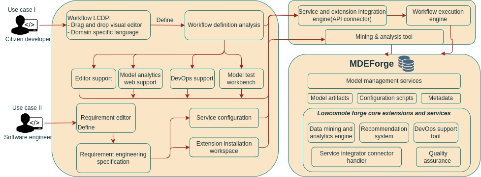

### Welcome to Lowcomote/MDEForge microservices

#### The microservices below are developed using Spring boot (Java)

---

### If you want to use the microservices without cloning the code,

### It gets even easier!!

#### Retrieve the image(microservice) you would like to run from my docker hub repo.

- Search my username _indamutsa_, and you will see the images available
- Copy and paste the command below in your terminal

_Image name example_

- indamutsa/model-query-image

###### The container name is optional, and you can set any name you want

##### Run the command below

```sh
docker run --name {container-name} -d -p 9000:8087 indamutsa/{image-name}
```

Inspect docker-compose.yml file to see the ports used by each service.

### The service will be available on port 9000 locally.

localhost:9000/api-docs

---

## If you want to pull the code locally and use it, just follow the instructions below

### Clone the repository

```sh
git clone https://github.com/Indamutsa/model-management-services.git
```

### Once downloaded you can run each service separately

```sh
cd microservice-folder
mvn spring-boot:run
```

### You can easily run the microservice

### The script run.sh:

1. Packages the service in a jar file
2. Containerizes the the jar service in a docker image
3. runs the service in background
4. The command below can take a port argument, if you dont provide it, it will use the default

#### Run the script with no port argument

```sh
./run.sh
```

#### or with port argument

```sh
./run.sh 9999
```

#### Head to the url below in your browser and you can use openapi 3.0 to test the service

---

localhost:9000/api-docs

####

### Running the cluster

#### Docker-compose

We can run the cluster using docker-compose. The docker-compose.yml file is in the root directory of the project.
But before you can run the cluster, you have to build the images and push them to the registry.
Be mindful the DSL backend image is tagged with the version and compose. The only difference, is that it can be directly accessed externally using localhost:8082

Hence the frontend image can access the backend image using the url above.
To get get started, just run the script below:

```sh
docker compose up --build --force-recreate
```

You can also run the cluster in background using the command below:

```sh
docker compose up -d --build --force-recreate
```

To stop the cluster, run the command below:

```sh
docker compose down -v --remove-orphans
```

This command is used to stop and remove all containers, networks, and volumes associated with the docker-compose file. It also removes all images not referenced by any existing containers. Run it causiously because it will remove the volumes, so make sure you have backed up the data you want to keep.

```sh
docker-compose down -v --rmi all --remove-orphans && docker system prune -a --volumes
```

You can access the services by inspecting the docker-compose.yml file.
There are model management services, and the DSL services that can be accessed using the openapi 3.0 documentation.



- ETL transformation service: `http://localhost:8085/mms/api-docs/transform`
- EVL validation service: `http://localhost:8086/mms/api-docs/validate`
- EOL query service: `http://localhost:8087/mms/api-docs/query`
- ECL comparison service: `http://localhost:8088/mms/api-docs/compare`
- EML merging service: `http://localhost:8089/mms/api-docs/merge`

These services are organized in a microservice architecture using spring boot. So we can access these services using the api gateway at `http://localhost:8080/mms/api-docs`.
To access the services above using the api gateway, you have to use the url below:

- ETL transformation service: `http://localhost:7500/api/mms/transform`
- EVL validation service: `http://localhost:7500/api/mms/validate`
- EOL query service: `http://localhost:7500/api/mms/query`
- EML merging service: `http://localhost:7500/api/mms/merge`


We have the the service registry and the config server that can be accessed using the url below:

- Service registry: `http://localhost:8761`

The above services can be composed and orchestrated using the DSL service which can be found at:

- DSL service: `http://localhost:8080`

Follow the documentation at the page to get started.

#### Kubernetes

We use helm to run the cluster.
-- Run the command below to install the chart

```sh
# Install the chart
helm install lowcomote helm-deployment/
```

-- If you want to uninstall the charts:

```sh
helm uninstall lowcomote
```

If you want to update the charts in the current directory. Run the command below:

```sh
helm upgrade lowcomote helm-deployment/
```

Before you can run these commands, make sure you have built and pushed on the cloud the correct containers.
After pushing on the cloud, you have to upgrade the helm charts values, especially the version of the container to retrieve the latest version.

In case you want to delete all the resources in the cluster, run the command below:

```sh
kubectl delete all,secrets,configmaps,pv,pvc --all --all-namespaces
```

For instance, here i would like to update the service and deployment above, so i removed them.

Then, now i can update the charts: helm upgrade lowcomote helm-deployment/

In case you want to forward a given container to localhost, use portforwarding

```sh
kube port-forward service/dsl-frontend-server 9999:8080
```

To enter a container while you are running the cluster:

```sh
kubectl exec -it dsl-backend-server -- /bin/sh
```

To get the node where the cluster is deployed:

```sh
kube get node -o wide
```

To connect to GKE cluster

```sh
gcloud container clusters get-credentials lowcomote-cluster --zone europe-west3-a --project lowcomote
```

To allow the cluster

```sh
gcloud compute firewall-rules create allowed-node-ports --allow tcp:30100
```

To log a deployment

```sh
kube logs deployment.apps/dsl-backend-deployment
```

---
